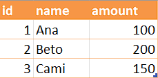
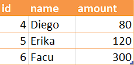
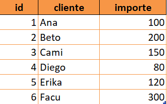

# CSV/Excel Automation (merge, selección, renombrado, validación)

## Instalar

```bash
python -m venv .venv && source .venv/bin/activate
# En Windows: .venv\Scripts\activate
pip install -r requirements.txt
```

## Probar con datos de ejemplo

```bash
python csv_tool.py \
  --inputs data/a.csv data/b.csv \
  --output out/merged.xlsx \
  --select "id,name,amount" \
  --rename "name:cliente,amount:importe" \
  --required "id,cliente"
```

Salida esperada:

- `out/merged.xlsx` con 6 filas y columnas `id, cliente, importe`.
- Logs informativos en consola con filas/columnas cargadas y validaciones.

## Uso general

- `--inputs`: 1..N archivos CSV/XLSX
- `--select`: columnas a mantener (opcional)
- `--rename`: renombrado "original:nuevo" separados por coma (opcional)
- `--required`: valida presencia de columnas clave (opcional)
- `--output`: `.csv` o `.xlsx`

## Capturas/Outputs

### Demostracion: CSV de origen "A".



### Demostracion: CSV de origen "B"



### Demostracion: Resultado de la combinación del CSV "A" y "B"


