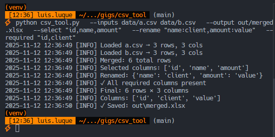

# CSV/Excel Automation (merge, select, rename, validate)

[Español (README.es.md)](README.es.md)

Automate repetitive CSV/Excel tasks with a simple Python CLI:

- Merge multiple CSV/XLSX files
- Select specific columns
- Rename columns with a mapping
- Validate required columns
- Export to CSV or XLSX

## Install

```bash
python -m venv .venv && source .venv/bin/activate
# On Windows: .venv\Scripts\activate
pip install -r requirements.txt
```

## Quick demo with sample data

```bash
python csv_tool.py \
  --inputs data/a.csv data/b.csv \
  --output out/merged.xlsx \
  --select "id,name,amount" \
  --rename "name:client,amount:value" \
  --required "id,client"
```

Expected:

- `out/merged.xlsx` with 6 rows and columns: `id, client, value`.
- Informative logs in the console with loaded rows/columns and validations.

## General usage

- `--inputs`: 1..N CSV/XLSX files
- `--select`: columns to keep (optional)
- `--rename`: mapping `"original:new"` separated by commas (optional)
- `--required`: validates presence of key columns (optional)
- `--output`: `.csv` or `.xlsx`

## Screenshots/Outputs

### CSV origin "A".


### CSV origin "B"


### Merged CSV "A" & "B"


### Logs in terminal


